# 🚀 Zorvyn Assignment – Finance Dashboard System


## Description

It is a **full-stack finance dashboard application** built using the MERN stack. It enables users to manage financial transactions, track income and expenses, and gain meaningful insights through analytics and dashboards.

This project is **backend-focused**, emphasizing clean architecture, role-based access control (RBAC), secure authentication, and efficient data processing. The frontend complements the backend by providing a modern UI for interaction and visualization.

---

##  Live Demo

🔗  https://zorvyn-assignment-f9x0.onrender.com/

> ⚠️ Note: The app may take a few seconds to load initially due to cold starts on free hosting.

---

##  Features

### Authentication & Authorization
- JWT-based authentication system
- Secure password hashing using bcrypt
- Role-based access control (Admin, Analyst, Viewer)
- Protected backend APIs and frontend routes
- Inactive user restriction handling

---

###  User Management
- User registration (signup)
- Login with secure token generation
- Update user role (self-controlled)
- Activate/Deactivate account
- Delete account functionality
- Pagination and filtering for user listing

---

### Transaction Management
- Create, update, delete transactions
- Ownership-based access control (users can only modify their own data)
- Advanced filtering:
  - Type (income/expense)
  - Category
  - Date range
- Keyword search (category, notes)
- Pagination & sorting support

---

### Dashboard Analytics
- Total income & expenses
- Net balance calculation
- Category-wise breakdown
- Recent transactions preview
- 31-day time-series trend (with missing date handling)

---

### Insights Engine
- Savings rate calculation
- Financial status detection (saving vs overspending)
- Top spending category
- Most frequent transaction category
- Monthly income vs expense trends
- Average monthly spending
- Highest spending month

---

## Tech Stack

###  Frontend
- React (Vite)
- React Router
- Context API (state management)
- Tailwind CSS
- Axios
- Recharts (data visualization)

---

###  Backend
- Node.js
- Express.js
- JWT (jsonwebtoken)
- bcryptjs
- Middleware-based architecture

---

###  Database
- MongoDB
- Mongoose (ODM)

---

### Others
- dotenv
- cors
- nodemon
- ESLint

---

##  Folder Structure

```

zorvyn-assignment/
├── backend/
│   ├── config/          # Database connection
│   ├── controllers/     # Business logic
│   ├── middlewares/     # Auth & role-based access
│   ├── models/          # Mongoose schemas
│   ├── routes/          # API routes
│   ├── util/            # Utility functions (JWT)
│   └── index.js         # Server entry point
│
├── frontend/
│   ├── public/
│   ├── src/
│   │   ├── components/  # UI components
│   │   ├── context/     # Global state
│   │   ├── pages/       # App pages
│   │   ├── lib/         # Utilities
│   │   └── App.jsx
│   └── vite.config.js
│
├── package.json
└── README.md

````

---

## Installation & Setup


### Prerequisites

- Node.js (v18 or higher)
- npm or yarn
- MongoDB (local or MongoDB Atlas)

---

### Clone Repository

```bash
git clone https://github.com/indkshitij/zorvyn-assignment.git
cd zorvyn-assignment
````

---

### Install Dependencies

#### Backend

```bash
npm install
```

#### Frontend

```bash
cd frontend
npm install
cd ..
```

---

### Environment Variables

#### Backend (`/backend/.env`)

```env
PORT=3000
MONGODB_URI=your_mongodb_connection_string
JWT_SECRET=your_secret_key
JWT_EXPIRES_IN=1d
CLIENT_URL=http://localhost:5173
```

---

#### Frontend (`/frontend/.env`)

```env
VITE_API_BASE_URL=http://localhost:3000/api
```

---

### Run Development Servers

#### Backend

```bash
npm run dev
```

#### Frontend

```bash
npm run client
```

---

## Backend Architecture Overview

The backend follows a **modular and scalable architecture**:

```
Routes → Controllers → Models → Database
           ↓
      Middleware Layer
```

### Key Highlights:

* Clear separation of concerns
* Middleware-driven authentication & authorization
* Secure and scalable API design
* Optimized queries using indexing and aggregation

---

##  API Endpoints

###  Authentication

| Method | Endpoint          | Description |
| ------ | ----------------- | ----------- |
| POST   | `/api/auth/login` | Login user  |

---

###  Users

| Method | Endpoint                       | Description                     |
| ------ | ------------------------------ | ------------------------------- |
| POST   | `/api/users/create`            | Create user                     |
| GET    | `/api/users/all-users`         | Get users (pagination + filter) |
| GET    | `/api/users/user/:id`          | Get user by ID                  |
| PUT    | `/api/users/update-role`       | Update own role                 |
| PUT    | `/api/users/update-status`     | Update active status            |
| DELETE | `/api/users/delete-my-account` | Delete account                  |

---

### Transactions

| Method | Endpoint                             | Description        |
| ------ | ------------------------------------ | ------------------ |
| POST   | `/api/transactions/create`           | Create transaction |
| GET    | `/api/transactions/all-transactions` | Get transactions   |
| PUT    | `/api/transactions/update/:id`       | Update transaction |
| DELETE | `/api/transactions/delete/:id`       | Delete transaction |

---

### Dashboard

| Method | Endpoint                      | Description       |
| ------ | ----------------------------- | ----------------- |
| GET    | `/api/transactions/dashboard` | Dashboard summary |

---

### Insights

| Method | Endpoint                     | Description        |
| ------ | ---------------------------- | ------------------ |
| GET    | `/api/transactions/insights` | Financial insights |

---

### Auth Header

```http
Authorization: Bearer <your_token>
```

---

## Screenshots / UI Preview

### Home Page
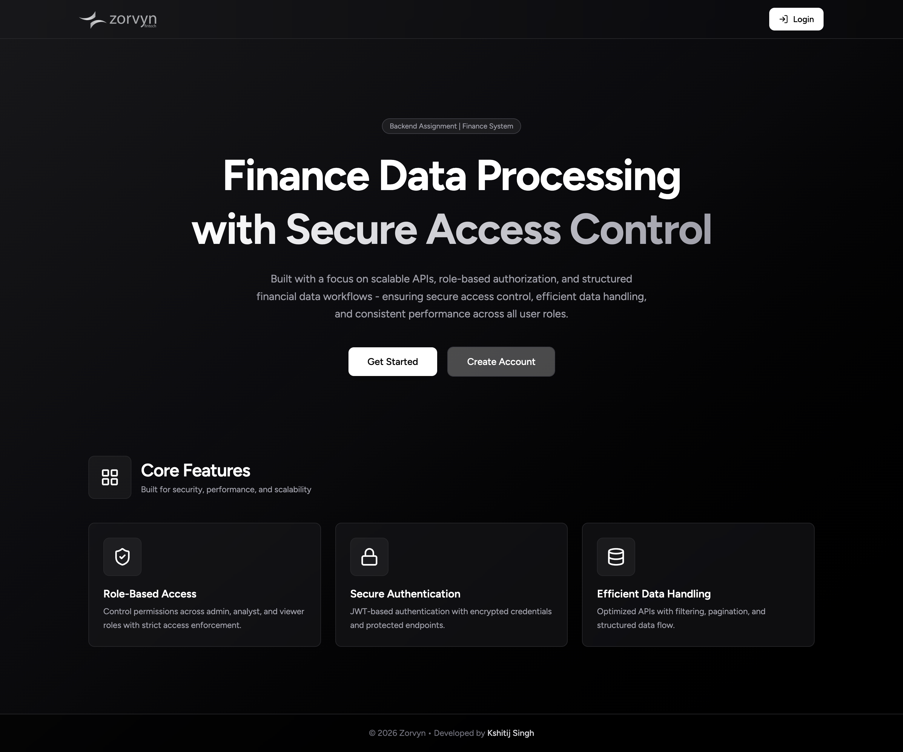

---

### Login Page
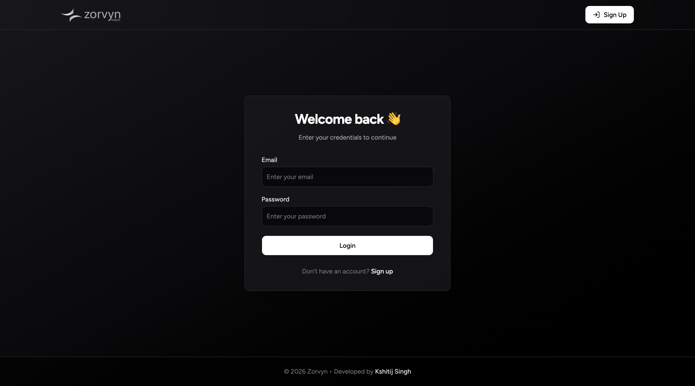

---

### Signup Page
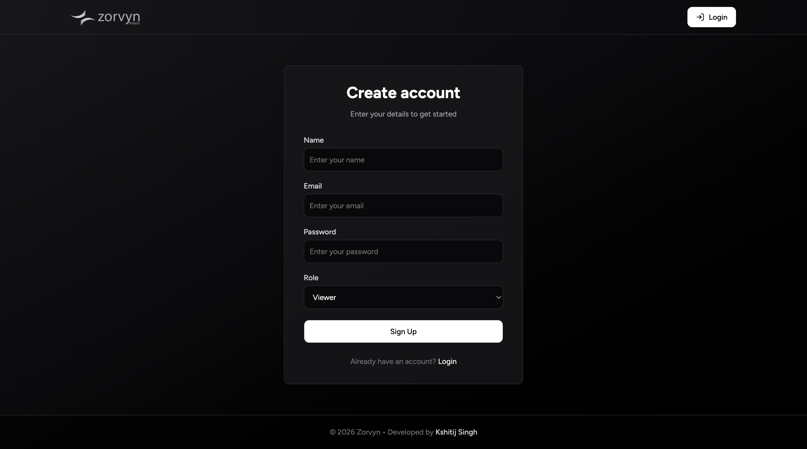

---

### Dashboard Overview
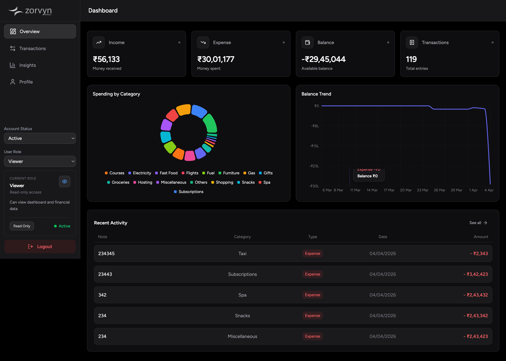

---

### Transactions Page
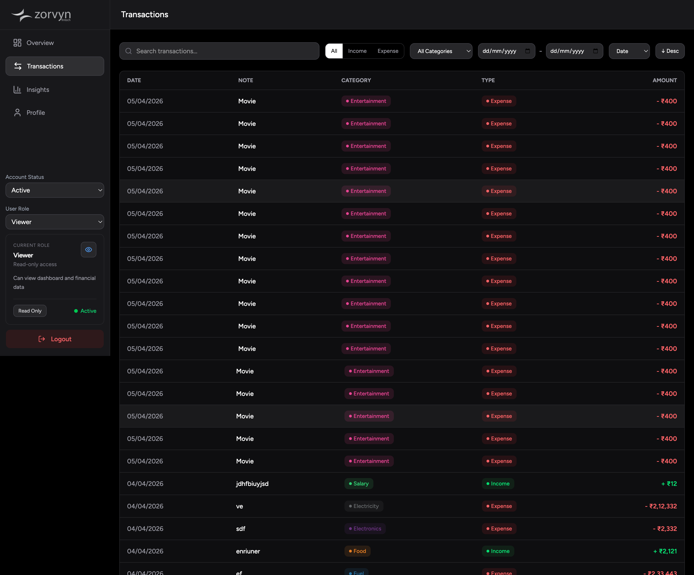

---

### Add Transaction
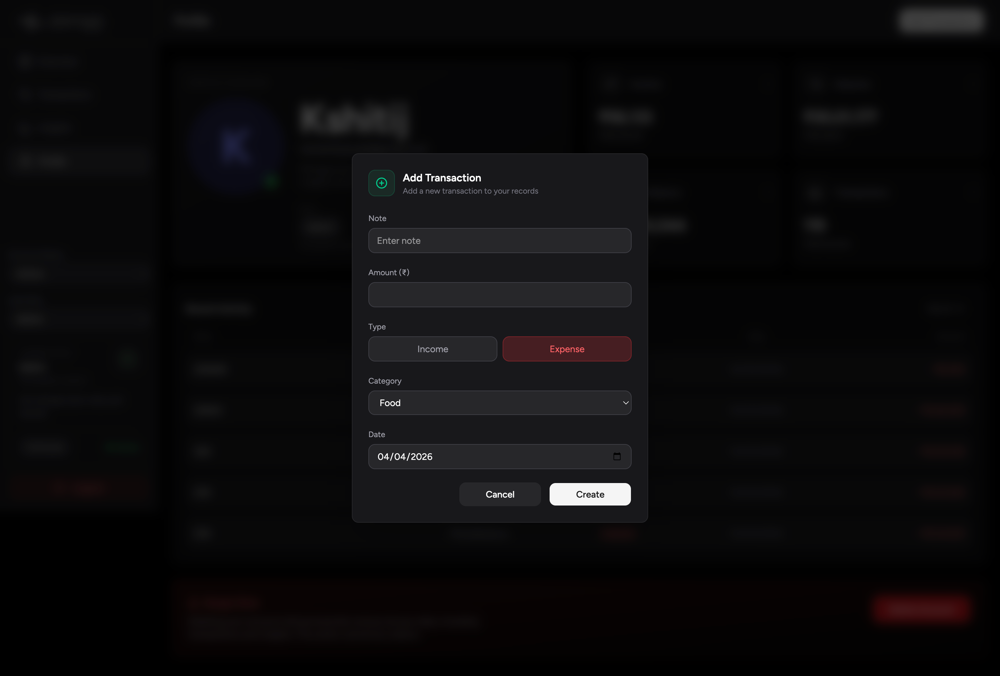

---

### Edit Transaction
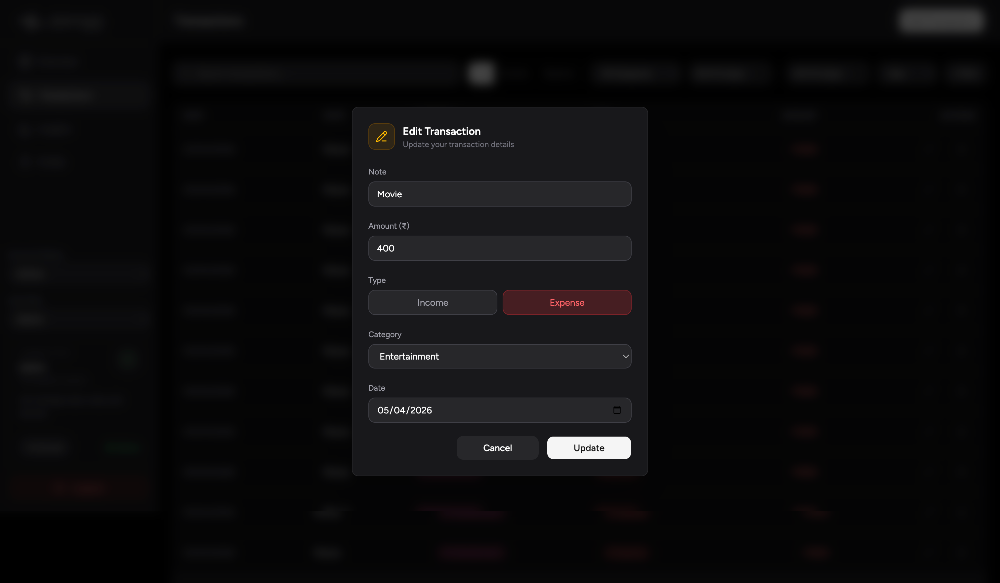

---

### Delete Modal
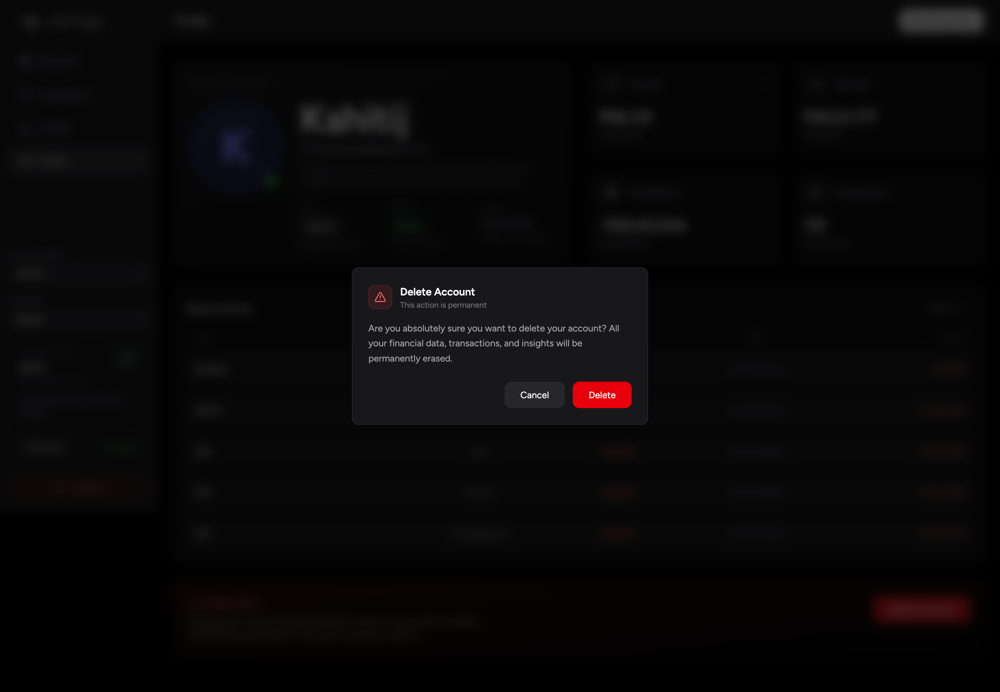

---

### Insights Page
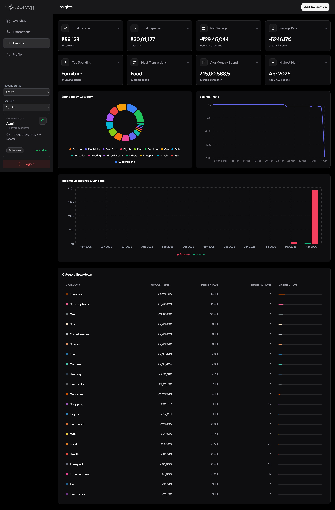

---

###  Profile Page
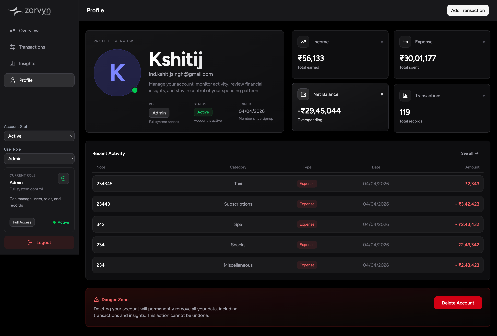

---

### Inactive User Screen
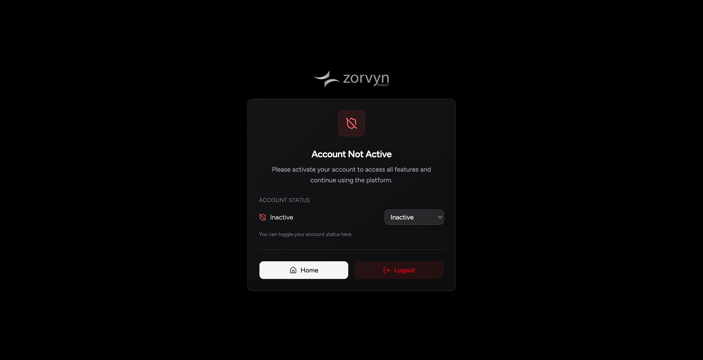

---

### Error 404 Page
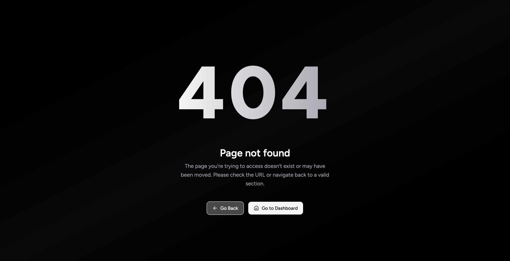

---

##  Usage Guide

1. Register a new account
2. Login to receive JWT token
3. Based on role:

   * Viewer → view dashboard & transactions
   * Analyst → access insights
   * Admin → full CRUD control
4. Add and manage transactions
5. Explore dashboard analytics and insights


---
## Author

**Kshitij Singh**

### Contact

* GitHub: [https://github.com/indkshitij](https://github.com/indkshitij)
* Email: ind.kshitijsingh@gmail.com

